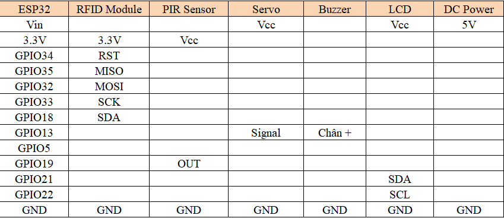
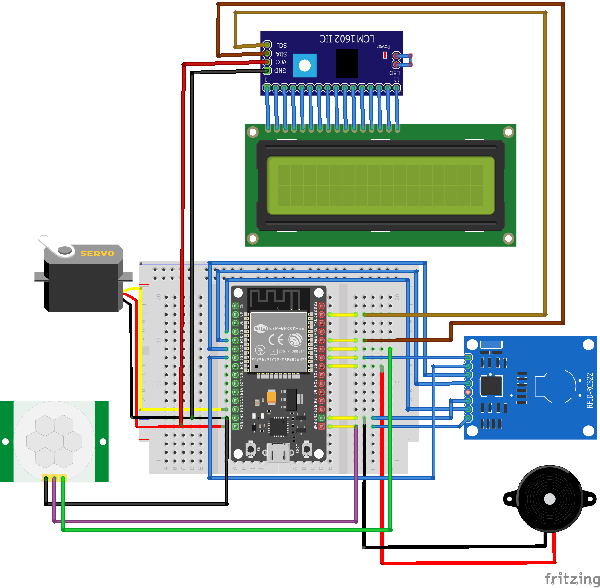
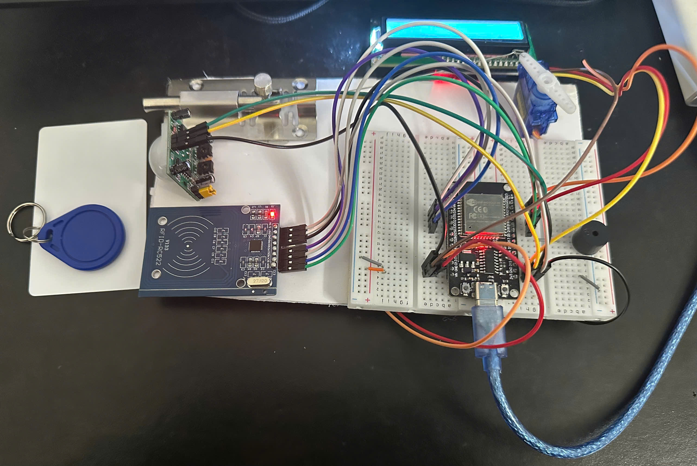
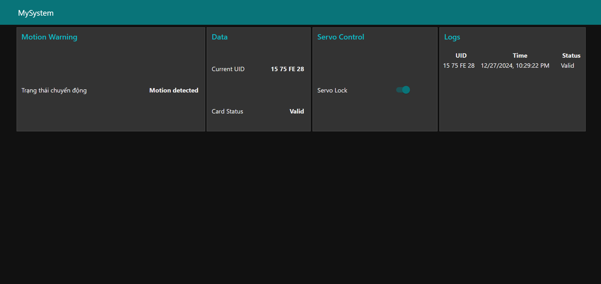

# Đề Tài : Hệ Thống Cảnh Báo Xâm Nhập Tích Hợp Mở Cửa Tự Động

## Tổng Quan Dự Án
Dự án “Hệ Thống Phát Hiện Xâm Nhập Tích Hợp Mở Cửa Tự Động” kết hợp các công nghệ IoT như ESP32, module RFID, servo motor SG90, LCD I2C, cảm biến chuyển động PIR và buzzer nhằm tạo nên một hệ thống phát hiện nếu có ai đó đến gần và điều khiển mở/khóa cửa thông minh nếu có quyền được vào. Hệ thống cung cấp giao diện giữa người dùng và thiết bị qua Node-RED Dashboard, cho phép hiển thị trạng thái xâm nhập, trạng thái cửa, theo dõi UID thẻ RFID, hiển thị lịch sử quét thẻ RFID và điều khiển đóng mở cửa bằng Servo nếu cần.

## Đặt Vấn Đề
Trong những tòa nhà, khu vực làm việc, hay nhà thông minh, việc quản lý an ninh và trạng thái cửa một cách tự động là nhu cầu cần thiết. Hệ thống truyền thống sử dụng chìa khóa có thể bị thất lạc, sao chép trái phép, hoặc mất nhiều thời gian thao tác. Giải pháp IoT đưa ra cấu trúc mở/khóa thông minh, bảo mật, và linh hoạt.

## Mục Tiêu
   - Tạo một hệ thống vừa an ninh với phát hiện xâm nhập với PIR Sensor và vừa tiện lợi với mở/khóa cửa tự động sử dụng RFID.
   - Hiển thị trạng thái trên màn hình LCD.
   - Gửi những thông báo quan trọng qua giao thức Node-RED Dashboard.
   - Đảm bảo an toàn và dễ sử dụng.

## Các Thành Phần Chính
- **Phần Cứng**:
  - **ESP32**: Kết nối với các cảm biến, xử lý dữ liệu, kích hoạt cảnh báo và giao tiếp với dashboard Node-RED qua MQTT.
  - **RFID (MFRC522)**: Đọc UID của thẻ.
  - **Servo SG90**: Điều khiển đống tác mở/khóa cửa.
  - **PIR Sensor**: Phát hiện và cảnh báo khi có người đến gần.
  - **Buzzer**: Phát âm thanh cảnh báo.
  - **LCD I2C (16x2)**: Hiển thị trạng thái.
- **Phần Mềm**:
  - **NodeRed Dashboard**: Giao diện điều khiển và hiển thị.
  - **MQTT Broker**: Kênh truyền thông tin giữa ESP32 và Node-RED..
  - **PlatformIO IDE**: Môi trường làm việc với ESP32.

## Sơ đồ kết nối chân

## Cách Hoạt Động
1. **Cách lấy UID từ thẻ RFID**:
   - Sử dụng file UID_Scan.h để lấy UID từ thẻ RFID.
   - Sử dụng UID đó cho main code.

2. **Phát hiện có người đến gần và cảnh báo**:
   - Khi có người hoặc vật thể đến gần, cảm biến chuyển động PIR sẽ nhận diện.
   - Đưa ra cảnh báo với buzzer.

3. **Quá Trình Mở Cửa**:
   - Khi người dùng quét thẻ RFID, UID sẽ được gửi tới ESP32.
   - ESP32 so sánh UID với danh sách cho phép.
   - Nếu đúng, servo quay để mở cửa và buzzer báo.
   - Nếu sai, buzzer sẽ có âm báo lỗi và LCD hiển thị “Wrong Card!”.

4. **Gửi và nhận thông tin qua MQTT**:
   - ESP32 publish UID và trạng thái cửa lên topic.
   - Node-RED hiển thị trạng thái và cho phép điều khiển mở/khóa từ xa.

5. **Xem lại dữ liệu và lịch sử, điều khiển servo**:
   - Node-RED dashboard cho phép người dùng xem trạng thái và thông tin UID, lịch sử quét UID
   - Node-RED dashboard cho phép người dùng điều khiển servo mở cửa

## Ưu Điểm Và Ứng Dụng
   - Bảo mật và tính an ninh cao: RFID và PIR giúp giảm nguy cơ sao chép chìa khóa.
   - Tiện lợi: Theo dõi và điều khiển từ xa qua MQTT.
   - Linh hoạt: Tùy chỉnh giao diện Node-RED dễ dàng.
   - Khả năng mở rộng: Tích hợp thêm các thiết bị IoT khác.

## Sơ đồ khối 

## Sơ đồ thuật toán

## Cấu hình NodeRed

## Cấu trúc và chức năng của các node trong NodeRed
- **Ghi lại và hiển thị lịch sử UID (RFID Logs)**:
  - **Node MQTT in**:
    - **Topic** : esp32/rfid/log
    - **Qos** : 0
  - **Node Function**: xử lí dữ liệu UID, trạng thái, thời gian.
  - **Node Tempalte (table)**: hiển thị lịch sử quét và nhận dạng UID.
- **Hiển thị thông tin của RFID ( RFID Information)**:
  - **Node MQTT in**:
    - **Topic** : esp32/rfid/uid
    - **Qos** : 0
  - **Node Function**: xử lí dữ liệu từ ESP32
  - **Node Text RFID UID Display** : Hiển thị UID ( Current UID )
  - **Node Text RFID Status** : Hiển thị trạng thái UID ( Card Status ) ( Valid/Invalid )
- **Nhận dữ liệu và cảnh báo xâm nhập**:
  - **Node MQTT in**:
    - **Topic** : esp32/motion/warning
    - **Qos** : 0
  - **Node Text Motion Warning**: hiển thị cảnh báo phát hiện xâm nhập trên dashboard
- **Điều khiển Servo mở cửa**:
  - **Node Switch**: LOCK/UNLOCK servo bằng một nút nhấn 
  - **Node MQTT out**:
    - **Topic** : esp32/servo/control
    - **Qos** : 0
- **Hiển thị trạng thái servo mở cửa**: 
  - **Node MQTT in**:
    - **Topic** : esp32/servo/status
    - **Qos** : 0
  - **Node Text Servo Status**: hiển thị trạng thái của Servo ( Locked/Unlocked )
    
## Mô phỏng hệ thống 

## Mô hình thực tế

## Kết quả  
**Demo Video**
[Watch My Demo Video](https://youtu.be/m7gjFQVQnFE)
 - Khi phát hiện chuyển động (ví dụ: có người đến gần cửa),Buzzer sẽ kêu khi có chuyển động, nhằm cảnh báo người dùng về sự hiện diện gần cửa
    
  - Khi người dùng quét thẻ RFID với UID đúng :
    - Servo motor điều khiển cơ chế mở/đóng cửa. Khi thẻ hợp lệ được quét, servo motor sẽ quay đến góc xác định, mở hoặc đóng cửa.
    - Cửa sẽ tự động mở hoặc đóng tùy theo trạng thái hiện tại của khóa.
    - LCD hiển thị thông tin khi quét thẻ đúng hoặc sai.
   
  - Tình trạng khóa cửa và phản hồi qua MQTT : 
    - Khi thẻ RFID hợp lệ được quét, hệ thống sẽ thay đổi trạng thái khóa và gửi thông báo về trạng thái cửa (mở hoặc đóng) qua MQTT đến các thiết bị giám sát.
    - Node-RED sẽ nhận các thông báo từ MQTT và cập nhật thông tin về trạng thái cửa và khóa trên dashboard.
    - Hệ thống sử dụng MQTT để giao tiếp giữa các thiết bị, gửi thông tin về tình trạng cửa và phản hồi từ các cảm biến.

  - Cảnh báo xâm nhập nếu thẻ UID sai :
    - Khi có sự phát hiện chuyển động và thẻ RFID không hợp lệ, hệ thống sẽ gửi thông báo cảnh báo "Invalid Card" qua LCD.
    - Cảnh báo này giúp người dùng nhận biết về hành vi không hợp lệ và có thể xử lý tình huống.

**Node-RED Dashboard**

 
  - Kết quả hiển thị trên Node-Red Dashboard :
    - Trạng thái chuyển động được nhận biết với text "Motion Detected"
    - Hiển thị UID, trạng thái thẻ RFID ( Card Status ) trên bảng điều khiển qua các Node Text.
    - Hiển thị lịch sử của lần quét thẻ RFID.
    - Khi muốn khóa điều khiển Servo, chỉ cần nhấn nút trên bảng điều khiển.

**Tính ổn định qua những lần thử nghiệm**
    - Hệ thống hoạt động ổn trong quá trình phát hiện xâm nhập, quét thẻ RFID và mở cửa tự động.
    - Tuy nhiên vẫn có những lần thử nghiệm hệ thống hoạt động thiếu ổn định do vấn đề kết nối phần cứng và chưa tối ưu hóa phần mềm.

## Hướng phát triển
  - Tích hợp trên điện thoại để giám sát và điều khiển trực quan hơn.
  - Tối ưu hóa phần mềm, cải thiện thuật toán.
  - Tăng cường bảo mật bằng cách sử dụng các phương pháp xác thực khác (ví dụ: mật khẩu hoặc sinh trắc học).
  - Thiết kế vỏ bọc mô hình hợp lí để bảo vệ hệ thống.
  - Tối ưu hóa năng lượng với nguồn cấp.
  - Tăng tính năng bảo mật cho hệ thống.
  - Có thể nghĩ đến kết hợp AI,ML và database.

## Kết luận 
"Hệ Thống Cảnh Báo Xâm Nhập Tích Hợp Mở Cửa Tự Động" là một giải pháp hiệu quả và tiện lợi cho việc kiểm soát truy cập và bảo mật. Hệ thống hoạt động ổn định, dễ sử dụng và có thể mở rộng thêm các tính năng bảo mật trong tương lai. Đây là một giải pháp đáng tin cậy cho các ứng dụng như cửa an ninh, hệ thống kiểm soát vào ra tại các tòa nhà, hoặc hệ thống nhà thông minh.

