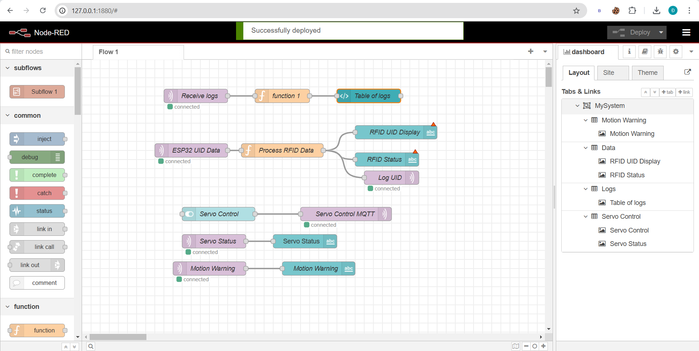

# Đề Tài : Hệ Thống Cảnh Báo Xâm Nhập Tích Hợp Mở Cửa Tự Động

## Tổng Quan Dự Án
Dự án “Hệ Thống Phát Hiện Xâm Nhập Tích Hợp Mở Cửa Tự Động” kết hợp các công nghệ IoT như ESP32, module RFID, servo motor SG90, LCD I2C, cảm biến chuyển động PIR và buzzer nhằm tạo nên một hệ thống phát hiện nếu có ai đó đến gần và điều khiển mở/khóa cửa thông minh nếu có quyền được vào. Hệ thống cung cấp giao diện giữa người dùng và thiết bị qua Node-RED Dashboard, cho phép hiển thị trạng thái xâm nhập, trạng thái cửa, theo dõi UID thẻ RFID, và điều khiển từ xa qua MQTT

## Đặt Vấn Đề
Trong những tòa nhà, khu vực làm việc, hay nhà thông minh, việc quản lý trạng thái cửa một cách tự động là nhu cầu cần thiết. Hệ thống truyền thống sử dụng chìa khóa có thể bị thất lạc, sao chép trái phép, hoặc mất nhiều thời gian thao tác. Giải pháp IoT đưa ra cấu trúc mở/khóa thông minh, bảo mật, và linh hoạt.

## Mục Tiêu
   - Tạo một hệ thống vừa an ninh với phát hiện xâm nhập và vừa tiện lợi với mở/khóa cửa tự động sử dụng RFID.
   - Hiển thị trạng thái trên màn hình LCD.
   - Gửi những thông báo quan trọng qua giao thức Node-RED Dashboard.
   - Đảm bảo an toàn và dễ sử dụng.

## Các Thành Phần Chính
- **Phần Cứng**:
  - **ESP32**: Kết nối với các cảm biến, xử lý dữ liệu, kích hoạt cảnh báo và giao tiếp với dashboard Node-RED qua MQTT.
  - **RFID (MFRC522)**: Đọc UID của thẻ.
  - **Servo SG90**: Điều khiển đống tác mở/khóa cửa.
  - **PIR Sensor**: Phát hiện và cảnh báo khi có người đến gần.
  - **Buzzer**: Phát âm thanh cảnh báo.
  - **LCD I2C (16x2)**: Hiển thị trạng thái.
- **Phần Mềm**:
  - **NodeRed Dashboard**: Giao diện điều khiển và hiển thị.
  - **MQTT Broker**: Kênh truyền thông tin giữa ESP32 và Node-RED..
  - **PlatformIO IDE**: Môi trường làm việc với ESP32.

## Sơ đồ kết nối chân

## Cách Hoạt Động
1. **Cách lấy UID từ thẻ RFID**:
   - Sử dụng file UID_Scan.h để lấy UID từ thẻ RFID
   - Sử dụng UID đó cho main code
2. **Quá Trình Mở Cửa**:
   - Khi người dùng quét thẻ RFID, UID sẽ được gửi tới ESP32.
   - ESP32 so sánh UID với danh sách cho phép.
   - Nếu đúng, servo quay để mở cửa và buzzer báo.
   - Nếu sai, buzzer sẽ có âm báo lỗi và LCD hiển thị “Wrong Card!”.

2. **Gửi và nhận thông tin qua MQTT:**:
   - ESP32 publish UID và trạng thái cửa lên topic.
   - Node-RED hiển thị trạng thái và cho phép điều khiển mở/khóa từ xa.

## Ưu Điểm Và Ứng Dụng
   - Bảo mật cao: RFID giúp giảm nguy cơ sao chép chìa khóa.
   - Tiện lợi: Theo dõi và điều khiển từ xa qua MQTT.
   - Linh hoạt: Tùy chỉnh giao diện Node-RED dễ dàng.
   - Khả năng mở rộng: Tích hợp thêm các thiết bị IoT khác.

## Sơ đồ khối 

## Sơ đồ thuật toán

## Cấu hình NodeRed

## Cấu trúc và chức năng của các node trong NodeRed
- **Nhận và hiển thị dữ liệu về khoảng cách**:
  - **Node MQTT in**:
    - **Topic** : Security/distance
    - **Qos** : 0
  - **Node Gauge (khoảng cách)**: hiển thị khoảng cách của vật thể so với giới hạn 
- **Nhận và hiển thị dữ liệu cho việc phát hiện chuyển động**:
  - **Node MQTT in**:
    - **Topic** : Security/motion
    - **Qos** : 0
  - **Node Text (trạng thái chuyển động)**: hiển thị trạng thái chuyển động bằng text
- **Nhận dữ liệu và hiển thị cảnh báo**:
  - **Node MQTT in**:
    - **Topic** : Security/warning
    - **Qos** : 0
  - **Node Notification (cảnh báo)**: hiển thị cảnh báo phát hiện xâm nhập trên dashboard
- **Thực hiện tắt cảnh báo (led+buzzer) bằng nút bấm nếu cần thiết**:
  - **Node Button**: tắt cảnh báo bao gồm led và buzzer nếu cần thiết bằng một nút nhấn 
  - **Node MQTT out**:
    - **Topic** : Security/reset
    - **Qos** : 0
    
## Mô phỏng hệ thống 

## Kết quả  

  - Sau khi phát hiện có xâm nhập, led đã sáng và buzzer đã kêu đúng như dự đoán
  - Kết quả hiển thị trên NodeRed Dashboard :
    - Gauge đã hiển thị dữ liệu về khoảng cách của sự xâm nhập đối với hệ thống
    - Cảnh báo phát hiện xâm nhập "Intruder detected!" hiển thị ở góc phải Dashboard
    - Trạng thái chuyển động được nhận biết với text "Motion Detected"
    - Có thể sử dụng button "Tắt cảnh báo" để tắt ngay led và buzzer nếu cần thiết
    - Khi không có xâm nhập, led và buzzer của hệ thống không hoạt động và trạng thái chuyển động hiển thị "No motion" 

## Hướng phát triển
  - Tích hợp trên điện thoại để giám sát và điều khiển trực quan hơn
  - Tăng tính chính xác bằng việc cải thiện thuật toán và thêm vào các cảm biến ( Radar, hình ảnh, ... )
  - Thiết kế vỏ bọc mô hình hợp lí để bảo vệ hệ thống
  - Tối ưu hóa năng lượng với nguồn cấp
  - Tăng tính năng bảo mật cho hệ thống
  - Có thể nghĩ đến kết hợp AI,ML để phân tích dữ liệu từ cảm biến và phân tích đối tượng phát hiện

## Kết luận 
Hệ thống "Distance Monitoring and Intrusion Warning System" là một giải pháp giám sát hiệu quả, kết hợp cảm biến và công nghệ IoT để phát hiện xâm nhập và giám sát từ xa. Với khả năng gửi cảnh báo qua MQTT và tích hợp với Node-RED Dashboard, hệ thống mang lại tính tiện lợi, bảo mật và khả năng tùy chỉnh cao. Đây là một giải pháp phù hợp để tăng cường an ninh cho các lối đi, hành lang, hoặc không gian cần bảo vệ, đồng thời có tiềm năng mở rộng ứng dụng trong các lĩnh vực như nhà thông minh, kho bãi và giao thông.

